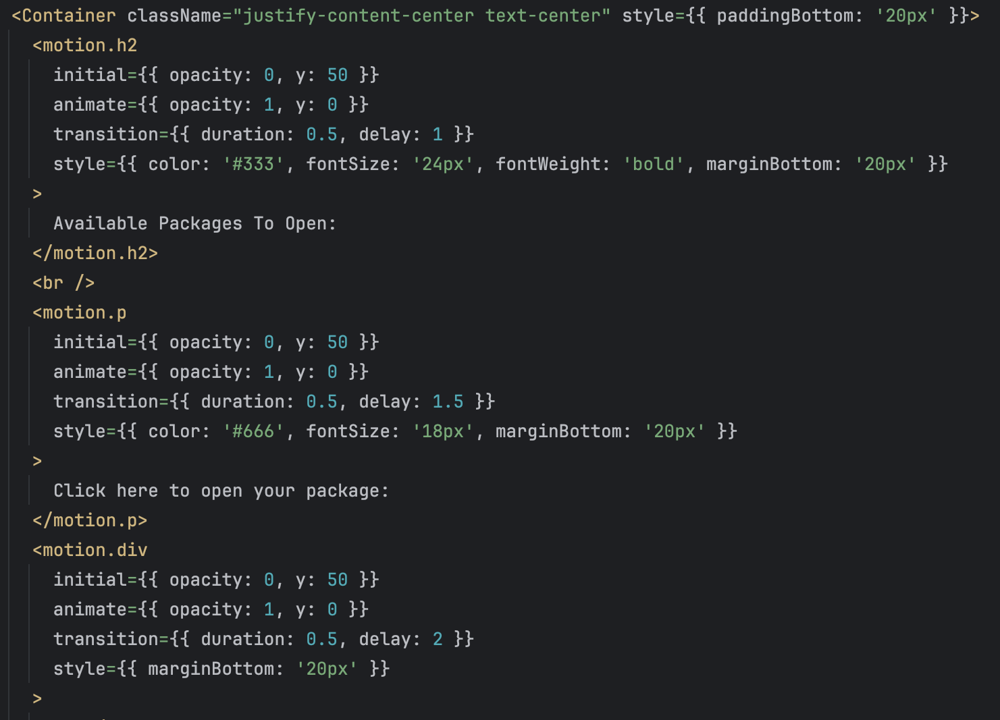

### I. Introduction

In recent years, the use of AI has exploded in all fields of study, notably in software engineering. AI is helpful in software engineering due to its ability to improve programming efficiency, aid in quick debugging, and optimize code more effectively. AI has become a crutch upon which software engineers can depend when they are stuck, serving as a valuable tool for many people.

### II. Personal Experience with AI:
I have used AI in class this semester in the following areas:

1. Experience WODs e.g. E18

I have never used AI for Experience WODs. I feel that since these homework assignments are designed to prepare you for In-class WODs, it does not make sense for me to use AI to complete the assignment, as it would hinder my learning process. If the primary goal is learning, I should tackle these assignments independently, as struggling leads to personal growth.

2. In-class Practice WODs

Similarly to the Experience WODs, I have never used AI for In-class practice WODs. For the same reason, if practice WODs are meant for improving skills, it is counterproductive to rely on AI.

3. In-class WODs

For the In-class WODs, I did end up using AI, and I found it very helpful. Despite my reluctance to heavily rely on AI, the pressure of these 100-point WODs compelled me to finish within the allowed time. For a majority of the WODs, I either completed them without AI or utilized it close to DNF time.

4. Essays

For essays, I do use AI, albeit solely to check for grammatical errors and punctuation mistakes. Personally, I find AI-generated essays noticeable due to their excessive use of filler words and distinct writing style, different from most students' normal styles. Nevertheless, AI can be a helpful tool for double-checking work, similar to how ChatGPT can assist in debugging code or resolving syntax errors.

5. Final project

For the final project, I also used AI. One example was for adding animations to the homepage of our website. Prior to the final project, I had no experience with animations, so I researched and found that I could use the framer-motion library in React to add animations. ChatGPT helped me with the syntax for the animations, and I created sliding animations for the homepage, with components appearing one after another. Here is what the code looks like:

6. Learning a concept / tutorial

I have never tried using AI to learn a concept or tutorial. Typically, I watch YouTube videos on the topic to better understand. I find it easier to grasp concepts when taught through lectures or screencasts/videos rather than through reading alone.

7. Answering a question in class or in Discord

I have never answered a question in class or in Discord, so I have never used AI for that purpose. If I were to, I would attempt to solve the issue independently before resorting to AI, in case the same issue occurs again. If I spent a significant amount of time on the issue and still couldn't resolve it, then I would consider using AI.

8. Asking or answering a smart-question

I have never asked or answered a smart-question, so I have never used AI for that purpose. Similarly, if I were to answer a question in class or in Discord, I would attempt to solve the issue on my own before relying on AI.

9. Coding example e.g. “give an example of using Underscore .pluck”

I have used AI to provide coding examples because it is helpful to see the correct syntax of certain functions. Having a template of code can provide an example of how to apply concepts in your own code.

10. Explaining code

In ICS-314, I have never used AI to explain code. Website development, which we focus on in ICS-314, is fairly easy for me to understand. Since I did not work on any backend functionality for our final project, everything was straightforward and easy to comprehend.

11. Writing code

I have used AI to generate code outlines for me. Typically, I have AI generate an outline, and then I fill in the details to achieve the desired results. This saves time as I don't need to write boilerplate code and can focus on modifying or filling in specific parts.

12. Documenting code

I haven't used AI to document code. If you are the one creating the code, you understand what each line does, allowing you to create comments for important lines yourself.

13. Quality assurance

I haven't used AI to ensure the quality of my code. If the code runs in the IDE and produces the desired result, I consider it good. I only rely on AI for resolving syntax errors until the code produces the desired result.

14. Other uses in ICS 314 not listed above

I have not used AI in any other way than the uses listed above.

### III. Impact on Learning and Understanding:

AI can have a significant impact on learning and understanding. Constant dependence on ChatGPT or any other AI sources can transform it from a tool into a necessity. At that point, it can be challenging to claim that you truly understand the material. Over-reliance on AI can hinder learning, as it provides quick solutions without fostering a deep understanding. Even for myself, I recognize that I sometimes rely too heavily on AI and need to spend more time reading documentation, debugging my own code, and practicing independently.

### IV. Practical Applications:

AI has numerous practical applications. For instance, if you need to complete a project urgently, using AI can expedite the process significantly. While AI can speed up tasks, it's essential to remember that over-reliance on it may hinder learning. If the goal is to maximize learning, it's advisable not to rely on AI too frequently. However, if efficiency is paramount, AI can be a valuable tool.

### V. Challenges and Opportunities:

One major challenge with AI is prompt engineering. You need to be specific when asking AI to generate code or help resolve issues. Vagueness in instructions can impede AI's ability to assist effectively. However, this challenge presents an opportunity for learning and experimentation, as it encourages individuals to be precise in their requests and potentially tackle problems independently.

### VI. Comparative Analysis:

Both traditional teaching and AI have their upsides and downsides in teaching software engineering. Traditional teaching offers a more natural learning experience, fostering deeper understanding through interaction with real instructors. On the other hand, AI-driven learning can be more engaging, but its effectiveness in fostering practical skills and deep understanding may be limited. Overall, traditional learning methods are still deemed more effective for software engineering education.

### VII. Future Considerations:

AI continues to improve and will remain a valuable resource for software engineers to efficiently generate code. As AI technology evolves, its capabilities will likely expand, making it even more useful over time. The primary limitation of AI currently lies in occasional inaccurate responses, but this is expected to improve with further advancements.

### VIII. Conclusion:

In conclusion, AI is a valuable resource in the field of software engineering. However, it's crucial to remember that AI is a tool and not a substitute for understanding. Over-reliance on AI can hinder learning, so it's important to strike a balance and ensure that learning is prioritized over expedience. Limiting the use of AI in education may ultimately contribute to deeper learning and skill development among students.