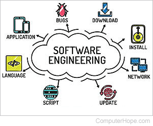

### More than just coding

In the technology world, you see a changing field that is always creating new things and getting better. At the beginning of the semester, I thought that I was just learning about one topic - web development but then I realized there is more to software engineering than just web development.  Software engineering includes elements like teamwork, open-source development like GitHub, software project management methods, and following coding guidelines. In this essay about my experiences and lessons learned from being a software engineering student--I highlight how big-picture thinking applies to every aspect of the field.

### Expanding my Horizons:

When the semester started, my main goal was to learn about web development. I wanted to understand languages such as HTML, CSS, and JavaScript in detail. Also, I aimed to grasp how we can create websites that are both dynamic and responsive - knowing every little aspect involved in building them. However, during this semester's progress, I recognized that software engineering is wider than just focusing on web development skills. Working with other students on team projects gave me a direct understanding of how crucial good communication is as well as task division and coordination – all important parts within the software engineering field.

### GitHub: A collaborative effort

Key to our teamwork was the use of GitHub, a tool that changes how we manage versions and work together as developers. We understood the importance of branching, merging, and handling conflicts through GitHub. This helped us improve our abilities in parallel development – an important part of current software engineering methods. Additionally, thanks to its strong issue-tracking system, we could apply an issue-focused management method which improved project structure while making problem-solving more effective.

### Embracing Coding Standards:

In our journey toward the completion of the final project, sticking to coding standards became one of the most important things that guided us in our final project development efforts. Keeping code formatting uniform, following name rules, or using modules correctly, coding standards helped our code be readable for each other so that we could fix any bugs that we noticed. We understood how critical readability, upkeep, and expansion were to the success of any software project; therefore we accepted these coding standards as an essential part of our final project.

### Teamwork makes the dream work

The most significant lesson gathered from this experience is about the core of teamwork in software engineering. Working with people who have different abilities and viewpoints highlighted the power of combined work. Working with others is not the easiest because everyone has different ideas on the project, but through issue-driven development, our team leader explained exactly what was wanted in the issue so it made it a lot smoother for the team. Working in a team can also be challenging when there are conflicts with merging branches to the main branch, but that is when communication comes in to resolve the problem.

### For the future:

Looking back, my study of web development during the semester has grown from simply focusing on the basic elements of coding to a broad comprehension of software engineering. Apart from learning different programming languages and frameworks, I have found that software engineering involves working together in teams, managing versions, projects, and following coding regulations. From working on team tasks to using GitHub and sticking to coding rules, I understand now how software engineering is a complete field - it needs cooperation between people for its success while also requiring new ideas and high-quality work. In the future, I will continue to practice what I have learned.

Note- ChatGpt was used to correct any grammar and punctuation mistakes
