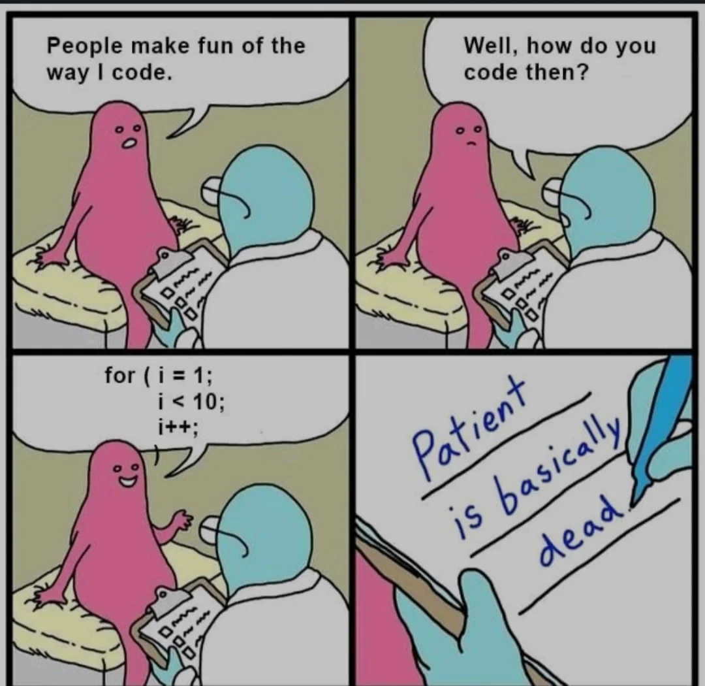

## Why do we automate things?

When I think about UI frameworks, I think of Bootstrap, React, and Angular. These are not easy frameworks to learn, and it takes more time to learn how to use them than just traditional HTML and CSS. While it could be argued that we could just use raw HTML and CSS, I believe that spending the time to learn these frameworks makes coding later more efficient and is worth the extra effort. I have made the comparison that learning these frameworks is similar to the reason we automate things. Is it worth it to spend the extra time to create code to make your life easier later? Absolutely.

##  Why are these frameworks worth the effort?

Well, these frameworks exist for a reason. They include icons, built-in classes, and open-source software to help improve visual appearance. React is also useful for making reusable code for any other project compatible with React. Like I said earlier, spending the time to create something that can be used later makes things more efficient and ends up saving you time. In the case of Bootstrap, taking the time to learn the framework allows you to create better-looking websites using built-in icons, classes, and makes automatically adapting screen size to a user's display possible.

## Putting it all together

The great thing about these frameworks is that you can still incorporate them into the normal HTML and CSS. Learning these frameworks, along with standard HTML and CSS, allows you to create more expressive and user-friendly websites by combining elements of multiple frameworks. Ultimately, the goal is to create the best, most responsive website possible, and we should utilize all of our tools in our tool belt.

Note- ChatGpt was used to correct any grammar and punctuation mistakes
