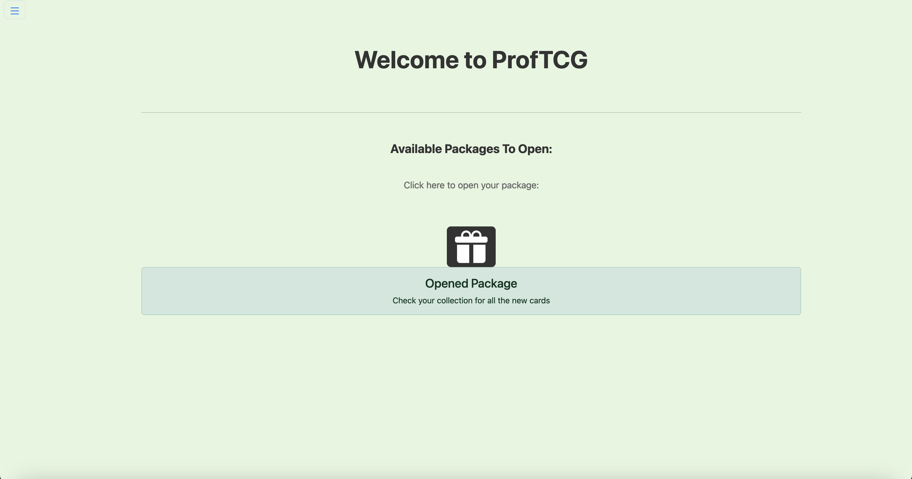
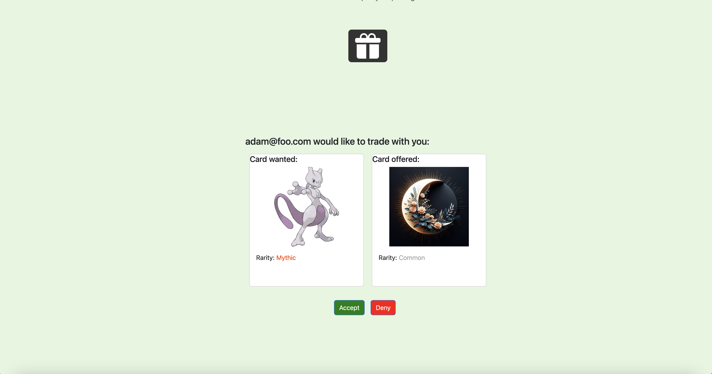

For our final project for ICS-314, we were assigned with creating a website where students can collect trading cards of their professors. The goal of this website was to facilitate student-to-student card trading,
introduce a rarity system, adding excitement with elusive cards, establish a trading hub for seamless exchanges between students, and empower professors to gift special cards as incentives for academic excellence

With that goal in mind, our group developed a trading system, the ability to add friends by username, the ability to view other people's collections, abd the ability for professors to reward students with rare cards for academic achievements. 

For this project, I was mainly responsible for front end development, as well as rerouting pages, deploying our site, styling components, and adding animations to some of our pages.

Here are the main pages I contributed to: 

This is what the main page looks like, and I also added animations to our home page. I was responsible for styling the trading component as well as the rest of the page. Beyond just this page, I also created our organization page, deployed our website, fixed our eslint errors, fixed minor redirect errors, and helped out in other errors if necessary. 

Overall, I thought our group did a good job navigating through the challenges of working in a team, whether it be fixing merge conflicts, or solving problems between differing views between group members. This project was a good opportunity to practice issue driven project management, and it made it very clear what are responsibilities were for the project. 